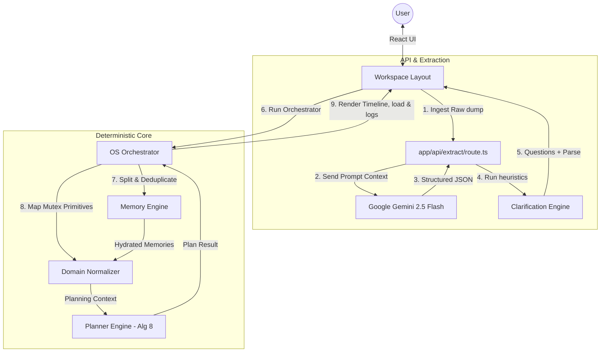

# SomeoneOS

🚀 **The Hybrid Cognitive Operating System**  
*The zero-friction interface between chaotic human thoughts and deterministic digital execution.*

---

## 📖 Overview

SomeoneOS is a cognitive proxy layer designed to eliminate planning friction. Users do not need to fill out databases, drag kanban cards, or estimate durations manually. Instead, they capture raw "brain dumps"—chaotic streams of consciousness—which SomeoneOS triages, analyzes, and schedules.

By segregating **probabilistic AI linguistic parsing** from **deterministic algorithmic scheduling**, SomeoneOS guarantees a logical, warning-annotated, and hallucination-free timeline.

---

## 📐 Hybrid Cognitive Pipeline

The lifecycle of a thought in SomeoneOS is divided into 5 distinct phases:



---

## 📂 Project Structure

```
someoneos/
├── app/                  # Next.js App Router routes & API controllers
├── components/           # UI components (Atomic UI & Workspace panels)
├── hooks/                # Custom React client hooks (useExtraction)
├── lib/                  # Core domain engines & utility suites
│   ├── domain/           # Intermediate domain normalizer & primitives
│   ├── memory/           # Personal memory category parser
│   ├── orchestrator/     # System orchestrator & risk calculator
│   └── planner/          # Deterministic task scheduling engine (Algorithm 8)
├── prompts/              # Strict Gemini extraction prompt templates
├── tests/                # Unified test suites and quality benchmarks
├── types/                # Unified TypeScript API schemas
└── docs/                 # Masters and architectural decisions
```

---

## 📚 Master Documentation

All developer onboarding guides, setup rules, architecture details, and specifications have been consolidated:

1. **[Technical Architecture Guide](file:///d:/Codes/Projects/someoneos/docs/architecture.md)**:
   - High-level design, information processing lifecycles, and subsystems.
   - Architectural Decision Records (ADRs).
2. **[Developer Manual & Handbook](file:///d:/Codes/Projects/someoneos/docs/development.md)**:
   - Setup guidelines, environment configuration, and onboarding demo scripts.
   - Verification and testing commands (`npm test`).
   - Core Engineering Constitution, AI rules, roadmap milestones, and AI development history.

---

## ⚡ Setup & Testing Quickstart

### Prerequisites
- Node.js (v20+ recommended)
- Firebase Account (for authentication context)
- Google Gemini API Key

### Installation
```bash
git clone <repository_url>
cd someoneos
npm install
```

### Run Application
```bash
npm run dev
```

### Run Quality Benchmarks
```bash
npm test
```

For more detailed setup, see the **[Developer Manual](file:///d:/Codes/Projects/someoneos/docs/development.md)**.
