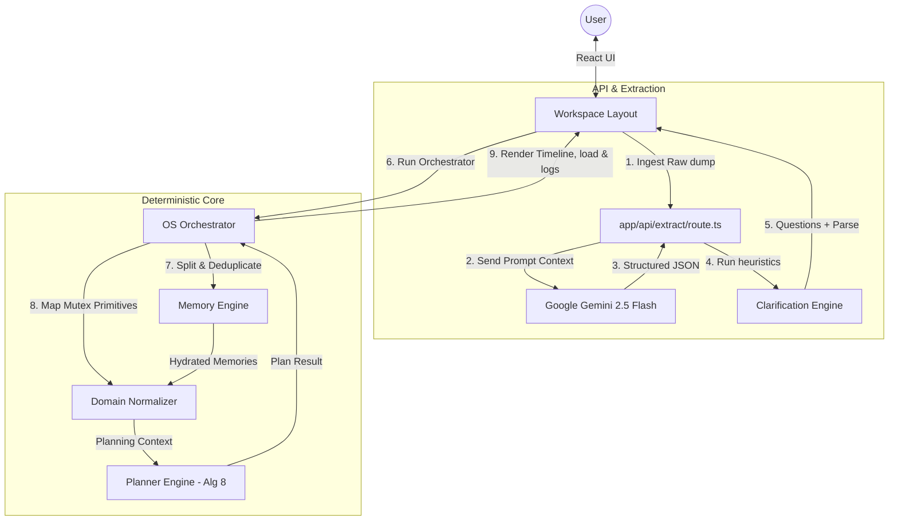

# SomeoneOS

🚀 **The Hybrid Cognitive Operating System**  
*The zero-friction interface between chaotic human thoughts and deterministic digital execution.*

---

## 📖 Overview
SomeoneOS is a cognitive proxy layer designed to eliminate planning friction. Users do not need to fill out databases, drag kanban cards, or estimate durations manually. Instead, they capture raw "brain dumps"—chaotic streams of consciousness—which SomeoneOS triages, analyzes, and schedules.

By segregating **probabilistic AI linguistic parsing** from **deterministic algorithmic scheduling**, SomeoneOS guarantees a logical, warning-annotated, and hallucination-free timeline.

---

## ⚖️ Why SomeoneOS is Different
1. **No LLM Schedule Authority ([ADR-001](docs/DECISIONS.md#L7-L14))**: Traditional AI planners let LLMs decide schedule timings directly, which leads to arithmetic errors, hallucinated dates, and collision constraints. SomeoneOS restricts the LLM strictly to extracting semantic data, using pure TypeScript algorithms for execution scheduling.
2. **Zero Ingestion Friction**: No required dropdowns, dates, or tag forms. The input is a simple, single stream-of-consciousness text field.
3. **Behavioral Pacing & Health Safety**: The scheduler identifies behavioral patterns (like procrastination tendencies) and health constraints (like chronic fatigue or stiffness) from your historical memories, automatically injecting time buffers and pacing breaks.
4. **Radical Transparency**: The engine maintains a comprehensive "Decision Log" of system inferences, detailing exactly why a buffer was added, why a task was postponed, or why an event was treated as a fixed constraint.

---

## 🛠️ Core Subsystems & Features

### 1. Zero-Friction Ingestion
- **Description**: Ingests messy, raw natural language inputs.
- **Location**: [`components/workspace/BrainDumpInput.tsx`](components/workspace/BrainDumpInput.tsx)

### 2. Linguistic Extraction API
- **Description**: Parses text inputs into structured entity JSON arrays using Google Gemini 2.5 Flash with strict MIME schemas.
- **Location**: [`app/api/extract/route.ts`](app/api/extract/route.ts) | [`prompts/extraction.ts`](prompts/extraction.ts)

### 3. Heuristic Clarification Engine
- **Description**: Evaluates parsed inputs using rule-based checks. If it detects critical missing details (e.g., event time, deadline date, executable goal estimate), it prompts the user with up to 3 targeted clarification questions.
- **Location**: [`lib/clarification.ts`](lib/clarification.ts)

### 4. Deterministic Memory Engine
- **Description**: Analyzes raw input for long-term routines, preferences, health constraints, and behavior patterns. It splits sentences, parses them using 7 composable extractors, and assigns deterministic, collision-free identifiers using a `djb2Hash` function.
- **Location**: [`lib/memory/memoryEngine.ts`](lib/memory/memoryEngine.ts)

### 5. Domain Normalization Layer
- **Description**: Translates extracted items and long-term user memories into mutually exclusive planning primitives (e.g., `EventAnchor`, `ActionableItem`, `AbstractGoal`, `HealthFactor`). Deduplicates statements based on conceptual string cleaners.
- **Location**: [`lib/domain/normalizer.ts`](lib/domain/normalizer.ts)

### 6. Sorter Engine (Algorithm 8)
- **Description**: Pure functional calculation sorting tasks deterministically. The sorting tree prioritizes:
  1. **Deadline Presence** (tasks with deadlines first, sorted alphabetically by date).
  2. **Priority Rank** (High = 3, Medium = 2, Low = 1).
  3. **Dependency Count** (fewer blockers first).
  4. **Alphabetical comparison** (lexicographical title match).
- **Location**: [`lib/planner/planner.ts`](lib/planner/planner.ts)

### 7. Cognitive Load & Failure Prediction
- **Description**: Computes a real-time user workload fatigue index (0-100) and executes failure projections based on task density, context-switching overhead, and behavioral multipliers.
- **Location**: [`lib/someoneos/failurePrediction.ts`](lib/someoneos/failurePrediction.ts)

### 8. Interactive Future Simulator & Auto-Repair
- **Description**: Projects plans across a 5-day cycle to map risk collisions and lets the user run a heuristic "Auto-Repair" loop to resolve schedule pressure.
- **Location**: [`components/workspace/ExecutionPreview.tsx`](components/workspace/ExecutionPreview.tsx) (Simulator Tab)

### 9. AI Schedule Negotiator
- **Description**: Evaluates schedule overload and prepares three alternative strategies for the user:
  - **Strategy A: Aggressive Sprint (Push Through)**: Ignores health buffers and behavior modifiers to squeeze all items into today's timeline.
  - **Strategy B: Adaptive Shielding (Sustained Velocity)**: Defers low-priority tasks to tomorrow to preserve focus buffers.
  - **Strategy C: Critical Path Isolation (Defensive Deferral)**: Schedules ONLY critical deadlines and high-priority tasks, adding extra safety padding.
- **Location**: [`lib/someoneos/scheduleNegotiator.ts`](lib/someoneos/scheduleNegotiator.ts)

---

## 📐 System Architecture

### Information Processing Flow
The cognitive lifecycle is divided into 5 distinct phases:



---

## 💻 Tech Stack & Requirements

| Layer | Technology / Library | Version |
| :--- | :--- | :--- |
| **Frontend Framework** | Next.js (App Router, React Client Components) | `^15.0.0` |
| **UI Rendering** | React | `^19.0.0` |
| **Styling Engine** | Tailwind CSS with PostCSS | `^3.4.14` |
| **Generative AI** | Google Gemini 2.5 Flash API (`@google/generative-ai`) | `^0.24.1` |
| **Authentication** | Firebase Client SDK (Google Sign-In) | `^12.15.0` |
| **Icon Set** | Lucide React | `^0.453.0` |
| **Developer Tools** | TypeScript, ESLint, Prettier, ts-node | (Internal Dev) |

---

## 📂 Project Directory Structure

```
someoneos/
├── app/                  # Next.js App routing infrastructure
│   ├── api/extract/      # Serverless LLM parser endpoint
│   ├── dashboard/        # Main workspace UI page controller
│   └── globals.css       # Core styling & glassmorphic system tokens
├── components/           # UI Component collections
│   └── workspace/        # Sidebar, Ingestion, Timeline & Simulator UI panels
├── docs/                 # Specifications & Architectural ADRs
├── hooks/                # Custom React state hooks (useExtraction)
├── lib/                  # Core processing engines
│   ├── domain/           # Concept Normalizer mapping
│   ├── memory/           # Personal memory category parser
│   ├── planner/          # Algorithm 8 Sorter implementation
│   ├── evaluation/       # 52 Scenario determinism validation suite
│   └── someoneos/        # System orchestrator & Failure Prediction
├── prompts/              # Strict Gemini extraction prompt templates
└── types/                # Unified TypeScript API schemas
```

---

## ⚡ Installation & Setup

### Prerequisites
- Node.js (v20+ recommended)
- Firebase Account (for authentication context)
- Google Gemini API Key

### Step-by-Step Local Deployment

1. **Clone the Repository & Install Dependencies**
   ```bash
   git clone <repository_url>
   cd someoneos
   npm install
   ```

2. **Configure Local Environment Settings**
   Create a `.env.local` file by copying the template:
   ```bash
   cp .env.example .env.local
   ```
   Add your secrets in `.env.local`:
   ```env
   NEXT_PUBLIC_FIREBASE_API_KEY=your-api-key
   NEXT_PUBLIC_FIREBASE_AUTH_DOMAIN=your-auth-domain
   NEXT_PUBLIC_FIREBASE_PROJECT_ID=your-project-id
   NEXT_PUBLIC_FIREBASE_STORAGE_BUCKET=your-storage-bucket
   NEXT_PUBLIC_FIREBASE_MESSAGING_SENDER_ID=your-sender-id
   NEXT_PUBLIC_FIREBASE_APP_ID=your-app-id
   GEMINI_API_KEY=your-gemini-api-key
   ```

3. **Run Developer Server**
   ```bash
   npm run dev
   ```
   Open [http://localhost:3000](http://localhost:3000) to view the landing screen.

4. **Verify Plan Engine Benchmarks**
   Run the evaluation script to ensure Algorithm 8 and the memory engines are performing deterministically:
   ```bash
   npx ts-node lib/evaluation/plannerEvaluation.ts
   ```

---

## 🧭 Developer Onboarding & Demo Script

To quickly demonstrate the cognitive pipelines without connecting a live Firebase Google Auth backend:
1. Land on the home page `/` and click **Demo Account / Sign-In**. This logs in a mock `judge@someoneos.ai` identity.
2. Observe the **Memory Bank Sidebar** seeded with:
   - Routine: *Drop kids off at school* (applied at 8:00 AM daily).
   - Preference: *Avoid early morning meetings*.
   - Health: *Lower back stiffness* (triggers stretch breaks at 1:00 PM).
   - Behavior: *Procrastination memory active* (+20% task estimate buffers).
3. Type this unstructured brain dump into the input field:
   > *"I have a Meta interview next Wednesday, but my back hurts so much and I hate early meetings. Need to review graph problems. Also need to buy groceries today."*
4. Press **Build My Week**. The **Clarification Panel** halts the process and prompts: *"When is your interview?"* 
5. Input `2:00 PM` and press **Continue**.
6. The schedule will load, applying the **+20% buffer** to graph reviews, injecting a **fatigue stretch break** at 1:00 PM, and locking the **Meta Interview** as a fixed anchor at 2:00 PM.

---

## 🔮 Future Roadmap
- **Stage 2 (In Progress)**: Database persistence. Connect Firebase Firestore to sync memories and schedule snapshots across sessions.
- **Stage 3**: Google Calendar & Outlook 2-Way Sync. Translate scheduled tasks into dynamic calendar focus blocks.
- **Stage 4**: Autonomous Tool Proxies. Implement GitHub, Gmail, and Slack APIs to execute tasks (e.g., draft emails/PR reviews) directly from the schedule.

---

## 📄 License
This project is licensed under the **MIT License**. See standard license text for details.
