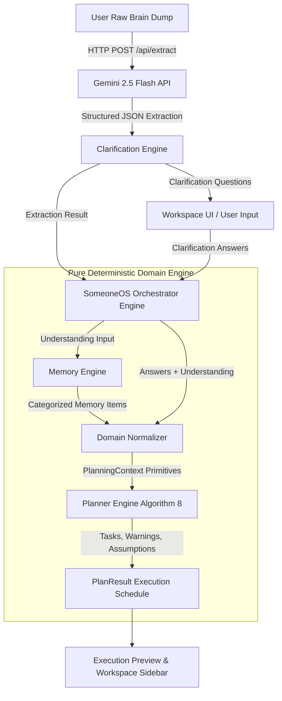
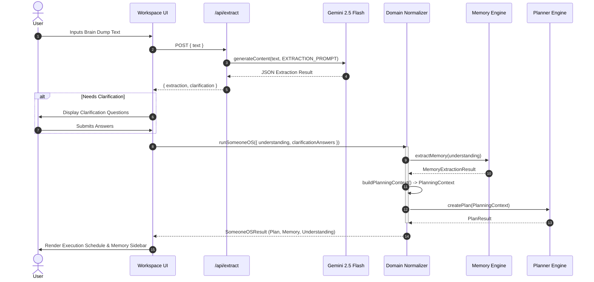

# ARCHITECTURE.md — SomeoneOS System Architecture & Core Pipeline

## 1. Architectural Overview
SomeoneOS is structured around a strict **Hybrid Cognitive Architecture**. It deliberately segregates **Probabilistic Linguistic Understanding** (handled by LLMs) from **Deterministic Domain Planning and State Management** (handled by pure TypeScript engines).

This boundary is non-negotiable. Probabilistic models are prone to hallucination, non-deterministic schedule calculations, and inconsistent constraint evaluation. By confining the LLM exclusively to the ingestion phase and passing structured domain primitives downstream to pure functions, SomeoneOS guarantees 100% reproducible, explainable, and reliable planning.

---

## 2. High-Level Architecture Pipeline

---

## 3. Engine Responsibilities & Module Relationships

### A. Understanding Extraction API (`app/api/extract/route.ts` & `prompts/extraction.ts`)
- **Why It Exists**: Transforms unorganized, multi-line unstructured natural language into structured linguistic entities.
- **Responsibilities**: Prompts Gemini 2.5 Flash with system instructions to return JSON matching the `ExtractionResult` interface (`events`, `deadlines`, `goals`, `constraints`, `priorities`, `emotionalSignals`, `missingInformation`).
- **Boundaries**: NEVER performs scheduling, task prioritization, or logic evaluation.

### B. Clarification Engine (`lib/clarification.ts`)
- **Why It Exists**: Identifies missing temporal or quantitative information required for deterministic scheduling before generating plans.
- **Responsibilities**: Evaluates extracted events and goals using deterministic regex rules (e.g., checks if deadlines have specific dates or if work goals lack estimated hours). Outputs up to 3 high-priority questions.

### C. Memory Engine (`lib/memory/memoryEngine.ts`)
- **Why It Exists**: Extracts persistent user traits, routines, and constraints to build long-term personal context.
- **Responsibilities**: Runs candidate statements through 7 modular extractors (`routine`, `preference`, `project`, `goal`, `relationship`, `health`, `behavior`). Generates deterministic unique IDs via `djb2Hash`.

### D. Domain Normalizer (`lib/domain/normalizer.ts`)
- **Why It Exists**: Acts as the semantic translation layer between raw extractions/memories and the downstream planner engine.
- **Responsibilities**: Classifies raw candidates into mutually exclusive domain primitives (`ActionableItem`, `DomainConstraint`, `EventAnchor`, `AbstractGoal`, `DomainPreference`, `DomainRoutine`, `HealthFactor`, `BehaviorFactor`). Applies duration lookup tables (`ESTIMATION_TABLE`) and links user clarification answers to deadlines.

### E. Planner Engine Algorithm 8 (`lib/planner/planner.ts`)
- **Why It Exists**: Computes the optimal, deterministic execution sequence for actionable items without LLM intervention.
- **Responsibilities**:
  1. Inspects `behaviorFactors` to apply buffer multipliers (e.g., +20% duration for procrastination).
  2. Flags `goals` as unplanned items with warnings.
  3. Formats `events` as fixed schedule anchors.
  4. Converts `actionableItems` into `Task` structures and sorts execution order deterministically based on: **Deadline presence -> Priority rank -> Dependency count -> Title alphabetical sorting**.

### F. SomeoneOS Orchestrator (`lib/someoneos/engine.ts`)
- **Why It Exists**: Serves as the single domain entry point (`runSomeoneOS`), providing a unified pure function interface for the web application or background jobs.

---

## 4. Data Flow Architecture

---

## 5. Architectural Principles
1. **Pure Functional Pipelines**: Core business logic modules (`memoryEngine`, `normalizer`, `planner`, `orchestrator`) are pure functions without side effects or hidden global state. Given identical input, they return identical output.
2. **Strict Single-Responsibility Domain Primitives**: Candidate statements are normalized into exactly ONE domain primitive by the Domain Normalizer, preventing item duplication across execution schedules.
3. **Deterministic Idempotency**: All IDs (memory IDs, domain task IDs) are deterministically generated from sanitized text strings via `djb2Hash`.
4. **Explicit Warning & Assumption Transparency**: The planner never silently modifies a user's task estimate or schedule. Any applied buffer or unexecutable goal creates an explicit `PlanAssumption` or `PlanWarning` entry in the `PlanResult`.
