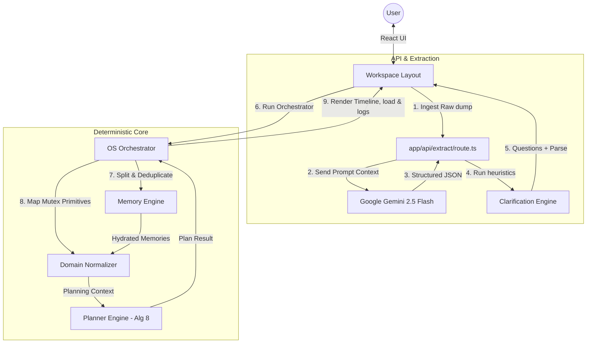

# SomeoneOS — Technical Architecture & Overview Specification

This document provides a comprehensive technical breakdown of the **SomeoneOS** software architecture, engines, data models, components, pipelines, and decisions.

---

## 1. Architectural Summary & Philosophy

Traditional task managers force a heavy manual entry tax on users. SomeoneOS resolves this by implementing a **Hybrid Cognitive Pipeline** that separates probabilistic machine learning parsing from deterministic algorithmic execution. Bounding LLM involvement strictly to language interpretation prevents scheduling hallucinations and overlapping events.

```
[Chaotic Stream of Consciousness]
              │
              ▼ (Linguistic Ingestion via Gemini 2.5 Flash API)
[Structured Text Entities (JSON Schema)]
              │
              ▼ (Domain Normalization Rules)
[Unified Planning Context (Actionable, Routines, Constraints)]
              │
              ▼ (Deterministic Sorting: Algorithm 8)
[Ordered Execution Schedule + Warnings & Assumptions]
```

### Core Design Principles
1. **Zero Ingestion Friction**: Immediate thought capture; no mandatory dropdowns, dates, or tag forms.
2. **Separation of Concerns**: LLMs interpret text; pure functional TypeScript code computes the calendar and tasks.
3. **Radical Transparency**: Explicit warnings and assumptions explain exactly why buffers are added or tasks are deferred.

---

## 2. Information Processing Lifecycle

The lifecycle of a thought in SomeoneOS is divided into 5 distinct phases:



---

## 3. Subsystem Specifications

### 3.1 Ingestion & Linguistic Extraction API
- **Location**: [route.ts](file:///d:/Codes/Projects/someoneos/app/api/extract/route.ts) | [extraction.ts](file:///d:/Codes/Projects/someoneos/prompts/extraction.ts)
- **Role**: Thin server-side handler querying `gemini-2.5-flash` with system instruction templates and a strict JSON schema.
- **Contract**: Parses chaotic paragraphs into separate lists for events, deadlines, goals, constraints, priorities, emotional signals, and missing information.

### 3.2 Heuristic Clarification Engine
- **Location**: [clarification.ts](file:///d:/Codes/Projects/someoneos/lib/clarification.ts)
- **Role**: Pure rule-based module evaluating extractions. If critical details (e.g. event time or priority deadlines) are missing, it halts the pipeline to present up to 3 targeted clarification questions to the user in a React panel.

### 3.3 Deterministic Memory Engine
- **Location**: [memoryEngine.ts](file:///d:/Codes/Projects/someoneos/lib/memory/memoryEngine.ts)
- **Role**: Classifies input statements into 7 categories (Routines, Preferences, Projects, Goals, Relationships, Health, Behavior).
- **Conventions**: Combines regex tokenizers with a `djb2Hash` string hashing function to guarantee identical text always resolves to the same identifier, allowing seamless in-memory deduplication across sessions.

### 3.4 Domain Normalization Layer
- **Location**: [normalizer.ts](file:///d:/Codes/Projects/someoneos/lib/domain/normalizer.ts)
- **Role**: Maps extracted entities and hydrated memories into standardized, mutually exclusive planning primitives (e.g. `EventAnchor`, `ActionableItem`, `AbstractGoal`, `HealthFactor`). Translates fuzzy timing estimates into deterministic durations using a priority-ranked lookup map.

### 3.5 Planner Engine & Sorter (Algorithm 8)
- **Location**: [planner.ts](file:///d:/Codes/Projects/someoneos/lib/planner/planner.ts)
- **Role**: Functional engine compiling the daily timeline. Applies a +20% estimation buffer if a procrastination tendency is present. Tasks are sorted deterministically based on:
  1. **Deadline Presence**: Urgent tasks first (sorted alphabetically by date).
  2. **Priority Rank**: High (3), Medium (2), Low (1).
  3. **Dependency Count**: Tasks with fewer blockers scheduled first.
  4. **Alphabetical tie-breaker**: Lexicographical title matching.

### 3.6 Cognitive Load & Failure Predictor
- **Location**: [failurePrediction.ts](file:///d:/Codes/Projects/someoneos/lib/orchestrator/failurePrediction.ts)
- **Role**: Calculates a user workload fatigue index (0-100) and predicts likelihood of failure using multipliers for procrastination habits, context-switching overhead, and task density.

### 3.7 AI Schedule Negotiator
- **Location**: [scheduleNegotiator.ts](file:///d:/Codes/Projects/someoneos/lib/orchestrator/scheduleNegotiator.ts)
- **Role**: Analyzes workload overflow and prepares three focus options for the user:
  - **Strategy A: Aggressive Sprint (Push Through)**: Ignores health buffers to pack all tasks today.
  - **Strategy B: Adaptive Shielding (Sustained Velocity)**: Defer low-priority tasks to protect routine blocks and health pacing.
  - **Strategy C: Critical Path Isolation (Defensive Deferral)**: Schedules strictly high-priority items with extra defensive safety padding.

---

## 4. Architectural Decision Records (ADRs)

### ADR-001: Separation of LLM Extraction and Pure Deterministic Planning
- **Status**: **ACCEPTED**
- **Decision**: Banish LLMs from task sorting and calculation. The LLM acts purely as a semantic translator. Scheduling is executed by TypeScript modules.
- **Rationale**: Eliminates arithmetic hallucinations and calendar overlap bugs.

### ADR-002: Intermediate Domain Normalization Layer (`PlanningContext`)
- **Status**: **ACCEPTED**
- **Decision**: Translate parsed entities into standardized domain primitives before they enter the scheduler.
- **Rationale**: Decouples the raw LLM response format from downstream planner engines, allowing LLM schema updates without breaking the scheduler.

### ADR-003: Deterministic Hash-Based ID Generation (`djb2Hash`)
- **Status**: **ACCEPTED**
- **Decision**: Combine clean string text with a `djb2Hash` function for IDs instead of generating random UUIDs.
- **Rationale**: Ensures repeated extractions of the same routine/preference result in the identical ID, enabling client-side deduplication.

### ADR-004: Execution Ordering via Algorithm 8
- **Status**: **ACCEPTED**
- **Decision**: Enforce multi-tier sorting tree: Deadline -> Priority -> Dependencies -> Title.
- **Rationale**: Guarantees a stable, predictable, and explainable daily execution agenda.

### ADR-005: Client-Side Authentication State Provider (`AuthProvider`)
- **Status**: **ACCEPTED**
- **Decision**: Implement Firebase Google OAuth wrapped in a React client state provider.
- **Rationale**: Ensures fast hydration of authentication context without blocking Next.js SSR layout compiles.
