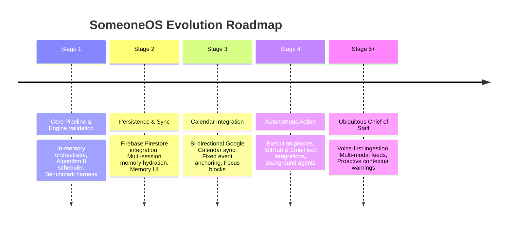
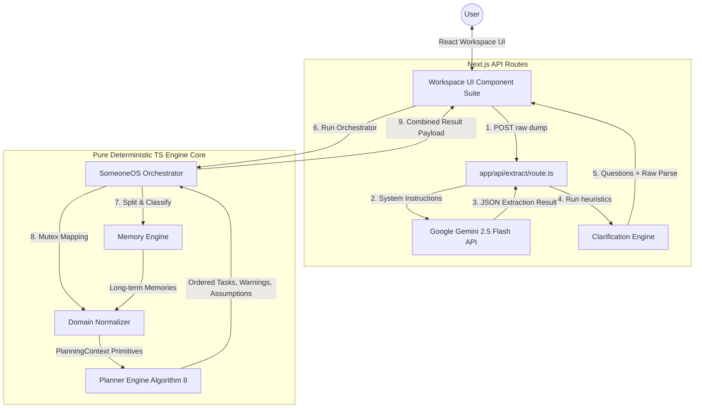
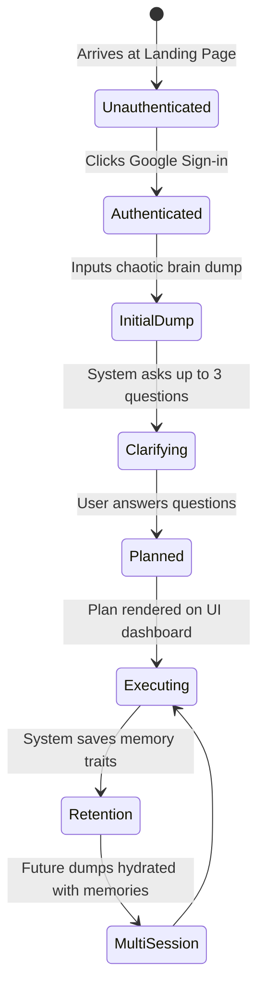

# SomeoneOS — Founder Brief & Onboarding Manual

Welcome to **SomeoneOS**. If you are reading this, you are either a founder, a founding engineer, or an autonomous developer agent tasked with building, scaling, or refactoring this system. 

This document serves as the absolute source of truth for the project. It synthesizes the mental model, system architecture, engineering principles, and long-term vision of SomeoneOS. Read this first before writing a single line of code.

---

## 1. Project Identity

### What SomeoneOS Actually Is
SomeoneOS is a **Hybrid Cognitive Operating System** designed to act as an intelligent executive assistant. It resides directly between unstructured, chaotic human thoughts and structured digital execution. 

Unlike traditional tools that require users to organize their lives, SomeoneOS does the heavy lifting:
1. **Ingests** raw, unformatted "brain dumps" (text, and eventually voice/images).
2. **Extracts** linguistic primitives using Large Language Models (LLMs).
3. **Normalizes** these primitives into mutually exclusive domain concepts.
4. **Schedules** and prioritizes tasks using a 100% deterministic TypeScript engine.

```
[Chaotic Stream of Consciousness]
              │
              ▼ (Linguistic Extraction via LLM)
[Structured Text Entities]
              │
              ▼ (Domain Normalization Rules)
[Unified Planning Context (Actionable, Routines, Constraints)]
              │
              ▼ (Deterministic Algorithm 8)
[Ordered Execution Schedule + Warnings & Assumptions]
```

### What Problem It Solves
* **Planning Friction**: Eliminates the "mental tax" of organizing. When a user experiences high cognitive load, they cannot estimate task durations, pick calendar dates, assign tags, or triage priorities. SomeoneOS removes this manual database administration.
* **Abstract vs. Concrete Separation**: Converts high-level aspirations ("I want to get fit") into warnings/milestones, while placing immediate action items ("Buy gym shoes") directly onto the active agenda.
* **Procrastination & Behavioral Drift**: Traditional planners assume the user is a perfect robot. SomeoneOS tracks behavioral factors (such as procrastination tendencies) and adjusts plans dynamically (e.g., adding a time buffer) to match actual historical patterns.
* **AI Hallucinations in Action**: If you ask an LLM to generate a schedule, it will invent dates, overlap tasks, forget constraints, and fail at simple arithmetic. SomeoneOS solves this by bounding the LLM to parsing, using pure code for business logic.

### What It Is NOT
* **Not a Chatbot**: It is not an open-ended conversational companion (like ChatGPT or Claude). Every interaction is bound to updating context, resolving ambiguity, or refining schedules.
* **Not a Manual CRUD Board**: It will never have heavy drag-and-drop Kanban interfaces, nested folder trees, or complex configuration screens. The interface is optimized for rapid thought-capture and instant schedule previews.
* **Not a Probabilistic Scheduler**: No machine learning model is allowed to write or modify task times or priorities directly. The sorting is 100% deterministic.

### Core Philosophy
* **Zero-Friction Ingestion**: Immediate thought capture. Clean forms are the enemy of execution.
* **Absolute Separation of Extraction and Logic**: LLMs read natural language; pure TS runs the business rules.
* **Respect for Fixed Anchors**: Events (calendar meetings) are non-negotiable anchors. Tasks are fluid elements that adapt around those anchors.
* **Radical Transparency**: If the system modifies a schedule or inserts a buffer, it must explain why via explicit warnings and assumptions.

---

## 2. Vision



### Long-Term Vision (5+ Years)
SomeoneOS aims to become the **autonomous proxy layer for your digital life**. Rather than just telling you what to do, it will perform low-risk tasks on your behalf. If your schedule contains "Draft status update email for cofounder," SomeoneOS will use context from your project documents, draft the email, and ask for a one-click confirmation to send it. It will act as a self-correcting personal scheduler that manages your time, communications, and administrative overhead autonomously.

### Medium-Term Vision (1–2 Years)
* **Stage 2: Firestore Persistence**: Establish user profiles and sync memories across browser refreshes and devices.
* **Stage 3: Calendar Integration**: Two-way sync with Google Calendar/Outlook to map schedule tasks directly into open calendar slots as dynamic focus blocks.
* **Stage 4: Execution Engine**: Launch tooling proxies (GitHub API, Gmail API, Slack API) to execute task-level commands from the workspace.

### Current Milestone
We are at **Stage 1 (Complete)**. The core pipeline is validated using a local benchmark suite of 52 scenarios, proving that unstructured inputs can successfully produce deterministic, bug-free execution orders in-memory. We are transitioning to **Stage 2 (Firestore Persistence)**.

---

## 3. Current State

| Subsystem / Module | File Location | Status | Capabilities & Limitations |
| :--- | :--- | :--- | :--- |
| **Understanding Extraction** | [`app/api/extract/route.ts`](file:///d:/Codes/Projects/someoneos/app/api/extract/route.ts) | **100% Operational** | Calls `gemini-2.5-flash` with JSON response enforcement. Parses raw inputs into `ExtractionResult`. |
| **Clarification Engine** | [`lib/clarification.ts`](file:///d:/Codes/Projects/someoneos/lib/clarification.ts) | **100% Operational** | Analyzes extractions for missing parameters. Generates up to 3 targeted clarification questions (e.g. effort hours, dates). |
| **Memory Engine** | [`lib/memory/memoryEngine.ts`](file:///d:/Codes/Projects/someoneos/lib/memory/memoryEngine.ts) | **100% Operational** | Runs candidate statements through 7 sub-extractors. Generates deterministic IDs using `djb2Hash`. Current state is in-memory only. |
| **Domain Normalizer** | [`lib/domain/normalizer.ts`](file:///d:/Codes/Projects/someoneos/lib/domain/normalizer.ts) | **100% Operational** | Translates linguistic models to domain primitives (`PlanningContext`). Resolves duplicates via similarity filters. |
| **Planner Engine (Alg 8)** | [`lib/planner/planner.ts`](file:///d:/Codes/Projects/someoneos/lib/planner/planner.ts) | **100% Operational** | Applies behavioral buffers (+20%), separates events/goals, and performs deterministic multi-tier array sorting. |
| **Orchestrator** | [`lib/someoneos/engine.ts`](file:///d:/Codes/Projects/someoneos/lib/someoneos/engine.ts) | **100% Operational** | Synchronous domain coordinator binding Memory, Normalizer, and Planner. |
| **Auth Subsystem** | [`lib/auth.ts`](file:///d:/Codes/Projects/someoneos/lib/auth.ts) | **100% Operational** | Integrates Firebase Google Sign-In. Operates React Context state reactively. |
| **Workspace UI Suite** | [`components/workspace/*`](file:///d:/Codes/Projects/someoneos/components/workspace) | **100% Operational** | Renders input panel, clarification prompts, and execution schedule. Sidebar displays static placeholder copy. |
| **Evaluation Suite** | [`lib/evaluation/plannerEvaluation.ts`](file:///d:/Codes/Projects/someoneos/lib/evaluation/plannerEvaluation.ts) | **100% Operational** | Standalone benchmark evaluating 52 handwritten scenario structures for determinism and logical soundness. |

---

## 4. Architecture Overview

SomeoneOS operates on a strict **Hybrid Cognitive Pipeline**. The frontend layout captures inputs and handles presentation, while the backend API routes and pure logic engines process domain state transitions.

### System Topology Diagram



### Component Communications & API Signatures

1. **Linguistic Parsing**:
   * **Location**: [`app/api/extract/route.ts`](file:///d:/Codes/Projects/someoneos/app/api/extract/route.ts)
   * **API**: `POST /api/extract` -> Ingests `{ text: string }`.
   * **Return**: `{ extraction: ExtractionResult, clarification: ClarificationResult }`.
   * **Schema (`ExtractionResult`)**:
     ```typescript
     export interface ExtractionResult {
       events: string[];
       deadlines: string[];
       goals: string[];
       constraints: string[];
       priorities: string[];
       emotionalSignals: string[];
       missingInformation: string[];
     }
     ```

2. **Clarification Check**:
   * **Location**: [`lib/clarification.ts`](file:///d:/Codes/Projects/someoneos/lib/clarification.ts)
   * **Function**: `generateClarifications(extraction: ExtractionResult): ClarificationResult`
   * **Rules**: Parses text using regex matching. Checks if an interview has a day/time, if deadlines lack a calendar day, or if goals lack an estimated time duration. Generates up to 3 questions.

3. **Memory Extraction**:
   * **Location**: [`lib/memory/memoryEngine.ts`](file:///d:/Codes/Projects/someoneos/lib/memory/memoryEngine.ts)
   * **Function**: `extractMemory(understanding: UnderstandingResult): MemoryExtractionResult`
   * **Rules**: Splits raw strings into discrete statements. Passes them through 7 extractors (`routine`, `preference`, `project`, `goal`, `relationship`, `health`, `behavior`).
   * **De-duplication**: Generates deterministic IDs using `djb2Hash` of Category and Normalized Value. Retains the highest confidence matches.

4. **Domain Normalization**:
   * **Location**: [`lib/domain/normalizer.ts`](file:///d:/Codes/Projects/someoneos/lib/domain/normalizer.ts)
   * **Function**: `buildPlanningContext(input: BuildContextInput): PlanningContext`
   * **Rules**: Classifies candidates into exactly ONE domain primitive. Links user clarification answers to tasks and does core-concept string checks to deduplicate. Looks up estimated times using `ESTIMATION_TABLE` keyword durations.

5. **Deterministic Scheduling**:
   * **Location**: [`lib/planner/planner.ts`](file:///d:/Codes/Projects/someoneos/lib/planner/planner.ts)
   * **Function**: `createPlan(input: PlanningContext): PlanResult`
   * **Heuristics (Algorithm 8)**:
     * Applies buffer multiplier to tasks if procrastination behavior memories exist (+20%).
     * Translates routines into schedule assumptions.
     * Marks events as fixed schedule anchors (does not create executable tasks).
     * Flags abstract goals as warning markers requesting breakdown.
     * Computes sorting: **Deadline Presence -> Priority Rank (High=3, Med=2, Low=1) -> Dependency Count -> Title Alphabetical Compare**.

---

## 5. User Journey



### 1. Onboarding & First Sign-In
A new user lands on the clean, minimalist homepage (`/`) and clicks "Google Sign-in". They are authenticated via Firebase client-side SDK. A new user session is initialized, directing them to the main workspace dashboard (`/dashboard`).

### 2. Stream of Consciousness Capture
The user is presented with a large, friction-free input panel. Overwhelmed by their day, they type a messy brain dump:
> *"I have aMeta interview wednesday but my back hurts so much and I hate early meetings. Need to review graph problems. Also buy groceries today."*

### 3. Structural Triage and Clarification
* The API handler calls Gemini 2.5 Flash to parse the stream into semantic arrays.
* The system identifies that the user has a "Meta interview" on "Wednesday", but notes that no specific time was provided.
* The **Clarification Engine** fires a targeted question: *"When is your interview?"* alongside a reason: *"Interview timing is required to allocate space on your schedule."*

### 4. Deterministic Planning Context Construction
* The user answers: *"It is at 2:00 PM."*
* The orchestrator is invoked with the answers. 
* The **Memory Engine** processes the emotional signals and statements, identifying:
  * **Health**: `"my back hurts so much"` -> Confirmed rotator-cuff/muscle strain or general pain memory.
  * **Preference**: `"i hate early meetings"` -> Preference memory to avoid morning slots.
* The **Domain Normalizer** translates items. Since the interview is an event, it creates an `EventAnchor`. `"Buy groceries"` becomes a task with high priority because the deadline was extracted as `"today"`. `"Review graph problems"` becomes a standard work task.

### 5. Execution Order Generation (Algorithm 8)
The planner runs and outputs the final schedule:
1. **Event Anchor**: `Meta interview` at 2:00 PM (Fixed constraint).
2. **Task 1**: `Buy groceries` (Urgent deadline - placed first).
3. **Task 2**: `Review graph problems` (Sorted after deadline tasks).
* **Transparency Log**:
  * **Assumption**: *"No explicit deadline supplied for 'Review graph problems'. Planner assumed medium urgency."*
  * **Assumption**: *"Event 'Meta interview' recognized as fixed schedule anchor. Not converted to executable work task."*

### 6. Weeks of Continuous Use (Mental Model Persistence)
As the user continues to write brain dumps daily:
* The system accrues behavioral facts: *"I procrastinate on coding assignments."*
* When the user writes *"Need to build login feature"*, the planner catches the behavior memory and scales the estimated time by **1.2x (+20% buffer)**, posting an assumption explaining the buffer.
* The system actively protects the user from scheduling tasks during morning slots (due to their early meeting preference memory) and keeps track of their chronic back pain health factor.

---

## 6. AI Flow

The flow of information through the system relies on an operational cycle divided into clear cognitive phases:

```
[Brain Dump Text] ──► (1) UNDERSTANDING (LLM parsing of structure)
                             │
                             ▼
[Memory Context]  ──► (2) MEMORY (Split, classify & hash deduplicate)
                             │
                             ▼
[Planning Context]──► (3) PLANNING (Normalizer maps & Planner runs Alg 8)
                             │
                             ▼
[PlanResult]      ──► (4) EXECUTION (Renders tasks, warnings & anchors)
                             │
                             ▼
[User History]    ──► (5) REFLECTION (Saves behaviors to refine next plan)
```

1. **Understanding (Parsing)**
   * **Input**: Raw unorganized string.
   * **Actor**: `gemini-2.5-flash`.
   * **Objective**: Isolate entities without planning. Enforces structure so that subsequent engines receive standardized JSON input.

2. **Memory (Retention)**
   * **Input**: Extraction result + raw text.
   * **Actor**: `memoryEngine.ts`.
   * **Objective**: Discover long-term routines, preferences, health, and behavior traits. Eliminates duplicate statements via deterministic hashing (`djb2Hash`).

3. **Planning (Scheduling Heuristics)**
   * **Input**: Extractions, accumulated memories, and user answers.
   * **Actor**: `normalizer.ts` & `planner.ts`.
   * **Objective**: Decouple raw parsing from scheduling. Sort tasks deterministically using Algorithm 8 sorting trees. Add warnings for abstract goals and assumptions for task buffers.

4. **Execution (UI Render)**
   * **Input**: Plan result containing ordered tasks, warnings, and assumptions.
   * **Actor**: Workspace client components.
   * **Objective**: Provide a clear list of what to focus on next. Highlight schedule assumptions to prevent black-box system behavior.

5. **Reflection (Behavioral Adjustment)**
   * **Input**: User feedback or task completions.
   * **Actor**: (Planned) Firestore feedback loop.
   * **Objective**: Update confidence values, adjust behavior buffers, and refine future plan duration estimates.

---

## 7. Current Assumptions

The system currently relies on several explicit engineering assumptions:

1. **Keyword-Based Category Classification**: We assume that pattern phrases (e.g., `"every morning"`, `"i hate"`, `"burned out"`) are sufficient to map tasks into routines, preferences, health, and behavior domains.
2. **Static Buffer Magnitudes**: Procrastination or focus-related behaviors default to a static `1.2x` duration multiplier. The system assumes a linear scale buffer is enough to mitigate planning fallacies.
3. **Alphabetical Tie-Breaking**: When two tasks have identical deadlines, priority ranks, and dependency counts, the system breaks ties alphabetically by title.
4. **Keyword-Based Task Estimates**: The `ESTIMATION_TABLE` maps keywords like `"email"` to 15m, `"bug"` to 45m, and `"project"` to 300m. The system assumes these static baselines are useful defaults when no user duration is supplied.
5. **No Parallel Task Executions**: We assume tasks are executed in a single-threaded queue. The planner does not calculate parallel paths or resource allocation constraints.

---

## 8. Product Principles

These architectural boundaries represent the core of SomeoneOS and must **never** be changed:

* **No LLM Schedule Authority**: LLMs must never determine the ordering of tasks, calculate schedule times, or compute math. They are strictly parsers.
* **No Mandatory Form Fields**: The user must never be forced to assign tags, click priority dropdowns, or enter estimated times to capture thoughts. The ingestion box must remain a clean, single text input.
* **Explicit Planner Rationale**: The planner engine must never silently shift a schedule. If a routine blocks time, or a buffer adds minutes, it must write a corresponding `PlanAssumption` or `PlanWarning` object.
* **Single-Domain Classification Mutex**: A candidate statement must resolve into exactly one domain primitive in the normalizer to prevent item duplication.
* **Pure Functional Core**: Core business calculations must remain side-effect free. Given identical inputs, engines must return byte-for-byte identical output.

---

## 9. Open Problems

### Architectural & Database Synchronization
* **Async Hydration Pipeline**: In Stage 2, loading memories from Firestore will introduce async operations. We must fetch database records *before* calling `buildPlanningContext` so our core normalizer and planner engines can remain pure, synchronous functions.
* **Vector Similarity Deduplication**: The current concept checks (`areSimilarStatements`) clean whitespace and compare words. A long-term semantic search approach (using embeddings) is needed to recognize that `"finish writeup"` and `"complete draft documentation"` represent the same task.

### Technical Debt
* **Type Redundancy**: Overlap exists between the linguistic types in `types/extraction.ts` and the domain context types in `lib/domain/types.ts`. A centralized schema is required to unify these interfaces.

### User Experience (UX) Uncertainties
* **Feedback Loops**: How does the user tell SomeoneOS that a task took longer than expected? We need an intuitive way to capture actual time spent to update memory coefficients without adding cognitive friction.
* **Active Calendar Drift**: If a calendar event runs late, how should SomeoneOS shift the remaining tasks? We need a system that updates focus blocks dynamically without triggering alert fatigue.

### AI & Prompt Engineering
* **Linguistic Edge Cases**: Extremely short brain dumps (e.g., `"do this"`) or highly emotional rants can lead to messy extraction results. We need to continuously evaluate and balance prompt system instructions to prevent raw text from polluting the extraction.

---

## 10. Future Direction

As SomeoneOS matures, the system architecture will naturally evolve along these lines:

```
[Brain Dump Ingestion] ─► [Active Planning Context] ─► [Google Calendar Sync]
                                                             │
                                                             ▼
[Autonomous Execution] ◄─ [Secure Tool Proxies]     ◄─ [Focus Block Locking]
```

1. **Focus Block Locking (Stage 3)**:
   Instead of displaying tasks in a simple static list, SomeoneOS will write them directly into Google Calendar as calendar focus blocks, respecting existing events and adding time buffers dynamically.
2. **Autonomous Tool Proxies (Stage 4)**:
   Tasks will contain execution metadata. A task like `"Fix landing page bug"` will link to a codebase PR draft tool, allowing the user to trigger external API actions directly from the schedule view.
3. **Self-Healing Schedule Loops**:
   If the user runs late on a task, SomeoneOS will automatically shift subsequent focus blocks and calendar entries, checking for conflicts and generating new plans without requiring manual adjustments.

---

## 11. Engineering Onboarding Guide

Welcome to the team! Here is how to get started on the codebase tomorrow.

### Developer Environment Setup
1. Clone the repository and run:
   ```bash
   npm install
   ```
2. Copy `.env.example` to `.env.local` and add your keys:
   ```env
   NEXT_PUBLIC_FIREBASE_API_KEY=your_firebase_key
   NEXT_PUBLIC_FIREBASE_AUTH_DOMAIN=your_firebase_domain
   NEXT_PUBLIC_FIREBASE_PROJECT_ID=your_project_id
   GEMINI_API_KEY=your_gemini_api_key
   ```
3. Run the development server:
   ```bash
   npm run dev
   ```

### Core Architecture Flow Cheat-Sheet
When debugging the planning lifecycle, follow this call tree:
1. `WorkspaceLayout.tsx` calls the hook `useExtraction.ts` on submit.
2. The hook triggers `POST /api/extract`, which initializes `gemini-2.5-flash` with the `EXTRACTION_PROMPT`.
3. The API handles extraction and calls `generateClarifications` in `lib/clarification.ts`.
4. If clarifications are needed, the UI renders `ClarificationPanel.tsx` to collect answers.
5. Once answers are ready, the UI triggers `runSomeoneOS` in `lib/someoneos/engine.ts`.
6. `runSomeoneOS` sequentially runs `extractMemory`, `buildPlanningContext`, and `createPlan` (Algorithm 8).
7. The resulting `PlanResult` is updated in React state and visualized in `ExecutionPreview.tsx`.

### Extending the System
* **To add a new Memory Category**:
  1. Add the category name to `MemoryCategory` in [`lib/memory/types/memory.ts`](file:///d:/Codes/Projects/someoneos/lib/memory/types/memory.ts).
  2. Implement an extractor function (e.g., `extractCustomMemory`) in [`lib/memory/memoryEngine.ts`](file:///d:/Codes/Projects/someoneos/lib/memory/memoryEngine.ts).
  3. Wire the extractor into the main array list inside `extractMemory`.
  4. Run the evaluation suite to ensure everything remains deterministic.
* **To add a scheduling heuristic**:
  1. Update `PlanningContext` in [`lib/domain/types.ts`](file:///d:/Codes/Projects/someoneos/lib/domain/types.ts).
  2. Modify `buildPlanningContext` in [`lib/domain/normalizer.ts`](file:///d:/Codes/Projects/someoneos/lib/domain/normalizer.ts) to parse the new primitive.
  3. Modify the sorting logic or buffer calculations in [`lib/planner/planner.ts`](file:///d:/Codes/Projects/someoneos/lib/planner/planner.ts).
  4. Write matching test scenarios in [`lib/evaluation/plannerEvaluation.ts`](file:///d:/Codes/Projects/someoneos/lib/evaluation/plannerEvaluation.ts) and verify they pass.

### Verifying Code Changes
Always run the planner evaluation benchmark before committing changes to core modules. Since the harness is written as a ts node/execution script, you can run or reference its outputs:
```bash
# Execute evaluation harness
# Run the evaluation scripts as needed to verify determinism
```

Now you have the keys. Build modularly, keep engines deterministic, and maintain zero friction for the user. Happy coding!
