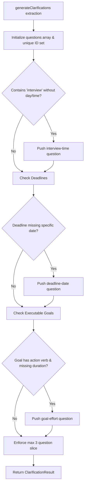

# Technical Specification: Clarification Engine

## 1. Purpose
The Clarification Engine is a pure deterministic rule engine that analyzes linguistic extractions to identify ambiguous, incomplete, or underspecified items (e.g., interviews without times, deadlines without specific dates, or complex executable goals without effort estimates). It generates targeted clarifying questions before plan computation.

---

## 2. Responsibilities
- Inspects extracted arrays (`events`, `deadlines`, `goals`, `missingInformation`).
- Detects missing temporal anchors using day/date regex pattern matching (`hasSpecificDay`).
- Identifies executable action goals using action verb keyword matching (`isExecutableGoal`).
- Formulates up to 3 concise, high-priority questions asking the user to supply missing details.

---

## 3. Inputs & Outputs
- **Inputs**: `extraction: ExtractionResult` ([types/extraction.ts](file:///d:/Codes/Projects/someoneos/types/extraction.ts)).
- **Outputs**: `ClarificationResult` ([types/clarification.ts](file:///d:/Codes/Projects/someoneos/types/clarification.ts)):
  ```typescript
  export interface ClarificationQuestion {
    id: string;
    question: string;
    reason: string;
  }

  export interface ClarificationResult {
    requiresClarification: boolean;
    questions: ClarificationQuestion[];
  }
  ```

---

## 4. Dependencies
- Shared types ([types/extraction.ts](file:///d:/Codes/Projects/someoneos/types/extraction.ts), [types/clarification.ts](file:///d:/Codes/Projects/someoneos/types/clarification.ts)).
- Zero external package dependencies (Pure TypeScript module).

---

## 5. Public Interfaces
- **Main Function**: `generateClarifications(extraction: ExtractionResult): ClarificationResult` in [lib/clarification.ts](file:///d:/Codes/Projects/someoneos/lib/clarification.ts).

---

## 6. Internal Workflow



---

## 7. Future Extension Points
- **Interactive Multi-Turn Questioning**: Support structured choice options (e.g., date picker widgets or time buttons) rather than open text prompt fields.
- **Dynamic Clarification Thresholds**: Adjust question generation aggressiveness based on user preference settings.

---

## 8. Known Limitations
- Relying on exact string keyword arrays (`DAYS_OF_WEEK`, `EXECUTABLE_ACTION_VERBS`) may miss uncommon phrasing or alternative languages.

---

## 9. Testing Strategy
- **Unit Tests**: Pass synthetic `ExtractionResult` objects containing ambiguous strings ("interview sometime", "finish project") and assert exact expected `ClarificationQuestion` outputs and capping rules (max 3).
