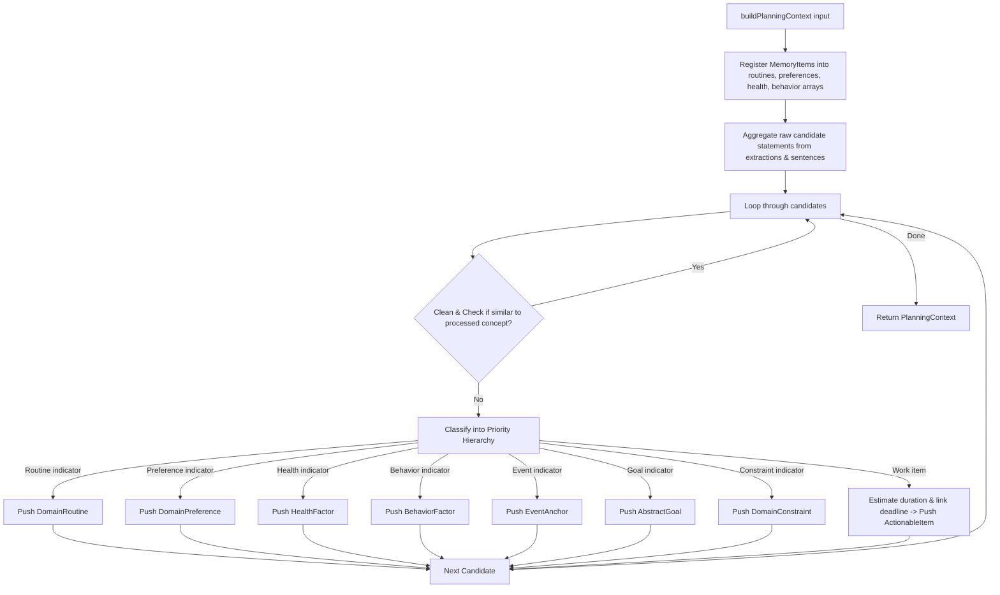

# Technical Specification: Domain Normalizer

## 1. Purpose
The Domain Normalizer acts as the semantic translation layer in SomeoneOS. It receives raw linguistic extractions, learned memories, and user clarification answers, mapping them into unified, mutually exclusive domain primitives (`PlanningContext`). This ensures upstream data cleanliness before passing context to the planner engine.

---

## 2. Responsibilities
- Normalizes raw candidate strings by cleaning titles and removing redundant whitespace.
- Classifies each candidate statement into exactly ONE mutually exclusive domain primitive:
  1. `DomainRoutine`: Daily/weekly recurring habits.
  2. `DomainPreference`: Environmental or timing preferences.
  3. `HealthFactor`: Emotional signals, injuries, or health constraints.
  4. `BehaviorFactor`: Tendencies impacting estimation buffers (e.g., procrastination).
  5. `EventAnchor`: Fixed schedule calendar commitments.
  6. `AbstractGoal`: Non-executable aspirational targets.
  7. `DomainConstraint`: General operational rules.
  8. `ActionableItem`: Concrete executable work tasks.
- Estimates task duration using keyword lookup tables (`ESTIMATION_TABLE`).
- Links explicit deadlines and clarification response answers to actionable tasks.
- Applies concept deduplication (`areSimilarStatements`) to eliminate redundant items.

---

## 3. Inputs & Outputs
- **Inputs**: `BuildContextInput` ([lib/domain/normalizer.ts](file:///d:/Codes/Projects/someoneos/lib/domain/normalizer.ts)):
  ```typescript
  export interface BuildContextInput {
    understanding: UnderstandingResult;
    memory?: MemoryExtractionResult;
    clarificationAnswers?: Record<string, string>;
  }
  ```
- **Outputs**: `PlanningContext` ([lib/domain/types.ts](file:///d:/Codes/Projects/someoneos/lib/domain/types.ts)): Contains arrays of `actionableItems`, `constraints`, `events`, `goals`, `preferences`, `routines`, `healthFactors`, `behaviorFactors`, and an ISO `timestamp`.

---

## 4. Dependencies
- Shared domain models ([lib/domain/types.ts](file:///d:/Codes/Projects/someoneos/lib/domain/types.ts)).
- External planner types ([lib/planner/types/planner.ts](file:///d:/Codes/Projects/someoneos/lib/planner/types/planner.ts)).

---

## 5. Public Interfaces
- **Main Function**: `buildPlanningContext(input: BuildContextInput): PlanningContext` in [lib/domain/normalizer.ts](file:///d:/Codes/Projects/someoneos/lib/domain/normalizer.ts).

---

## 6. Internal Workflow



---

## 7. Future Extension Points
- **Dynamic Learning Estimation**: Replace static duration lookup tables (`ESTIMATION_TABLE`) with personalized machine learning models based on user completion history.

---

## 8. Known Limitations
- Relying on rigid indicator keyword lists (`ABSTRACT_GOAL_INDICATORS`, `EVENT_INDICATORS`) requires continual updates to handle diverse phrasing.

---

## 9. Testing Strategy
- **Unit & Benchmark Verification**: Tested extensively via `lib/evaluation/plannerEvaluation.ts` scenarios to ensure candidates are properly classified into single-domain primitives without duplication.
