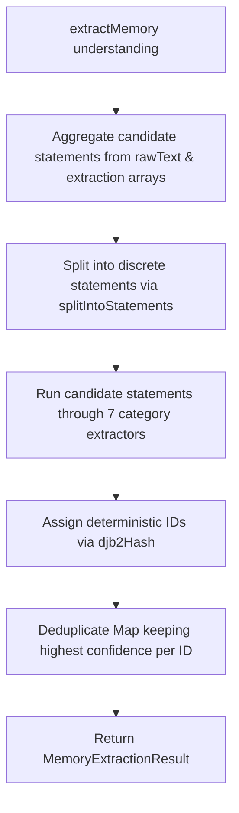

# Technical Specification: Memory Engine

## 1. Purpose
The Memory Engine is a pure deterministic extraction and deduplication module responsible for discovering persistent user habits, routines, preferences, health conditions, relationships, and behavioral tendencies from linguistic understanding streams.

---

## 2. Responsibilities
- Splits raw understanding text and extracted strings into individual discrete statements (`splitIntoStatements`).
- Passes statements through 7 domain-specific pattern extractors:
  1. `extractRoutineMemory`: High-frequency routines ("every morning", "daily").
  2. `extractPreferenceMemory`: Strong likes/dislikes ("i hate", "i love", "i prefer").
  3. `extractProjectMemory`: Active project endeavors ("building", "developing", "portfolio").
  4. `extractGoalMemory`: Long-term aspirational targets ("i want to", "my goal is").
  5. `extractRelationshipMemory`: Key social entity roles ("my mom", "my manager").
  6. `extractHealthMemory`: Physical/mental health signals ("adhd", "migraine", "back pain").
  7. `extractBehaviorMemory`: Self-reported habits ("i procrastinate", "forget deadlines").
- Assigns deterministic unique string IDs using `djb2Hash` hashing on category and sanitized value text.
- Deduplicates memory items across categories, preserving entries with highest confidence scores.

---

## 3. Inputs & Outputs
- **Inputs**: `understanding: UnderstandingResult` ([types/understanding.ts](file:///d:/Codes/Projects/someoneos/types/understanding.ts)).
- **Outputs**: `MemoryExtractionResult` ([lib/memory/types/memory.ts](file:///d:/Codes/Projects/someoneos/lib/memory/types/memory.ts)):
  ```typescript
  export interface MemoryItem {
    id: string;
    category: MemoryCategory;
    value: string;
    confidence: number;
    reason: string;
  }

  export interface MemoryExtractionResult {
    memories: MemoryItem[];
    extractedCount: number;
    timestamp: string;
  }
  ```

---

## 4. Dependencies
- Internal memory types ([lib/memory/types/memory.ts](file:///d:/Codes/Projects/someoneos/lib/memory/types/memory.ts)).
- Pure composable string utilities within [lib/memory/memoryEngine.ts](file:///d:/Codes/Projects/someoneos/lib/memory/memoryEngine.ts).

---

## 5. Public Interfaces
- **Main Function**: `extractMemory(understanding: UnderstandingResult): MemoryExtractionResult` in [lib/memory/memoryEngine.ts](file:///d:/Codes/Projects/someoneos/lib/memory/memoryEngine.ts).
- **Standalone Extractors**: `extractRoutineMemory`, `extractPreferenceMemory`, `extractProjectMemory`, `extractGoalMemory`, `extractRelationshipMemory`, `extractHealthMemory`, `extractBehaviorMemory`.

---

## 6. Internal Workflow



---

## 7. Future Extension Points
- **Semantic Vector Deduplication**: Augment djb2 hash exact matching with vector embeddings to merge semantically equivalent memories (e.g., "I hate early meetings" vs "Dislike morning meetings").
- **Temporal Memory Decay**: Implement decay functions reducing confidence scores for obsolete memories over time.

---

## 8. Known Limitations
- Relying on pattern arrays requires expanding phrase dictionaries to capture regional slang or idiom variations.

---

## 9. Testing Strategy
- **Unit Tests**: Executed via [lib/memory/testMemoryEngine.ts](file:///d:/Codes/Projects/someoneos/lib/memory/testMemoryEngine.ts). Verifies statement parsing, category assignment, confidence scoring, and ID hashing idempotency.
