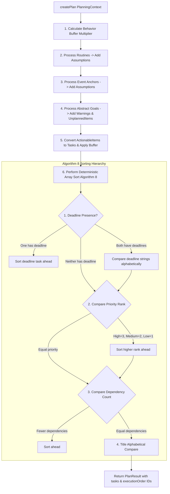

# Technical Specification: Planner Engine (Algorithm 8)

## 1. Purpose
The Planner Engine is the pure deterministic scheduling core of SomeoneOS. Consuming a normalized `PlanningContext`, it computes execution priority, resolves task dependencies, applies behavioral time buffer modifiers, separates fixed schedule anchors from tasks, and outputs an explainable execution plan without LLM hallucination.

---

## 2. Responsibilities
- Inspects `behaviorFactors` to apply dynamic duration buffer multipliers (e.g., +20% duration if procrastination is detected).
- Processes `routines`, adding explicit schedule constraint assumptions.
- Treats `events` as non-executable fixed schedule anchors (`PlanAssumption`).
- Flags `goals` as unplanned items with actionable step warnings (`PlanWarning`, `UnplannedItem`).
- Converts `actionableItems` into executable `Task` structures, calculating simple deterministic keyword dependencies ("after", "then").
- Sorts execution order deterministically using **Algorithm 8**.

---

## 3. Inputs & Outputs
- **Inputs**: `input: PlanningContext | PlannerInput` ([lib/planner/types/planner.ts](file:///d:/Codes/Projects/someoneos/lib/planner/types/planner.ts)).
- **Outputs**: `PlanResult` ([lib/planner/types/planner.ts](file:///d:/Codes/Projects/someoneos/lib/planner/types/planner.ts)):
  ```typescript
  export interface Task {
    id: string;
    title: string;
    priority: TaskPriority;
    estimatedMinutes: number;
    dependsOn: string[];
    deadline: string | null;
    category: string;
    reason: string;
  }

  export interface PlanResult {
    tasks: Task[];
    executionOrder: string[];
    warnings: PlanWarning[];
    assumptions: PlanAssumption[];
    unplannedItems: UnplannedItem[];
    timestamp: string;
  }
  ```

---

## 4. Dependencies
- Internal planner types ([lib/planner/types/planner.ts](file:///d:/Codes/Projects/someoneos/lib/planner/types/planner.ts)).
- Domain context types ([lib/domain/types.ts](file:///d:/Codes/Projects/someoneos/lib/domain/types.ts)).

---

## 5. Public Interfaces
- **Main Function**: `createPlan(input: PlanningContext | PlannerInput): PlanResult` in [lib/planner/planner.ts](file:///d:/Codes/Projects/someoneos/lib/planner/planner.ts).

---

## 6. Internal Sorting Algorithm (Algorithm 8 Workflow)



---

## 7. Future Extension Points
- **Topological DAG Sorting**: Upgrade simple inline string dependency checks to full Directed Acyclic Graph (DAG) cycle detection and validation.
- **Dynamic Calendar Window Packing**: Allocate exact start/end time slots based on live calendar free-busy intervals.

---

## 8. Known Limitations
- Inline dependency matching relies on titles containing explicit keywords like "after" or "then".

---

## 9. Testing Strategy
- **Evaluation Benchmark Suite**: Verified by [lib/evaluation/plannerEvaluation.ts](file:///d:/Codes/Projects/someoneos/lib/evaluation/plannerEvaluation.ts) across 50+ hand-written benchmark test suites validating sorting accuracy, buffer calculation, and warning generation.
