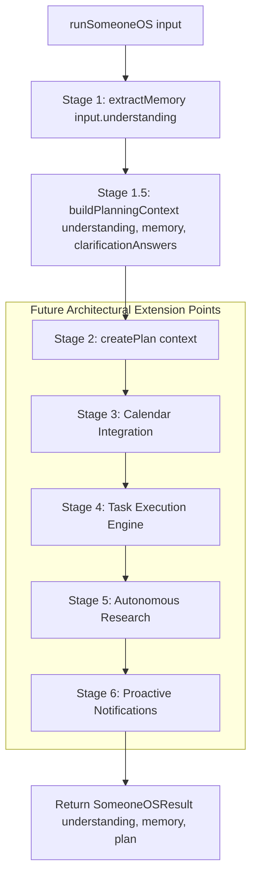

# Technical Specification: SomeoneOS Orchestrator Engine

## 1. Purpose
The SomeoneOS Orchestrator Engine (`lib/someoneos/engine.ts`) is the main domain entry point and execution coordinator for the application. Operating as a pure synchronous function, it orchestrates memory extraction, domain normalization, and task planning into a unified computational pipeline.

---

## 2. Responsibilities
- Serves as the single domain API interface for external consumers (React client components, API routes, or background tasks).
- Executes processing stages sequentially in a functional pipeline.
- Integrates memory extraction (`extractMemory`), domain context building (`buildPlanningContext`), and plan creation (`createPlan`).
- Defines clear modular extension points for future integrations (Calendar, Execution, Research, Notifications).

---

## 3. Inputs & Outputs
- **Inputs**: `input: SomeoneOSInput` ([lib/someoneos/engine.ts](file:///d:/Codes/Projects/someoneos/lib/someoneos/engine.ts)):
  ```typescript
  export interface SomeoneOSInput {
    understanding: UnderstandingResult;
    clarificationAnswers: Record<string, string>;
  }
  ```
- **Outputs**: `SomeoneOSResult` ([lib/someoneos/engine.ts](file:///d:/Codes/Projects/someoneos/lib/someoneos/engine.ts)):
  ```typescript
  export interface SomeoneOSResult {
    understanding: UnderstandingResult;
    memory: MemoryExtractionResult;
    plan: PlanResult;
  }
  ```

---

## 4. Dependencies
- Understanding types ([types/understanding.ts](file:///d:/Codes/Projects/someoneos/types/understanding.ts)).
- Memory engine ([lib/memory/memoryEngine.ts](file:///d:/Codes/Projects/someoneos/lib/memory/memoryEngine.ts)).
- Domain normalizer ([lib/domain/normalizer.ts](file:///d:/Codes/Projects/someoneos/lib/domain/normalizer.ts)).
- Planner engine ([lib/planner/planner.ts](file:///d:/Codes/Projects/someoneos/lib/planner/planner.ts)).

---

## 5. Public Interfaces
- **Main Exported Function**: `runSomeoneOS(input: SomeoneOSInput): SomeoneOSResult` in [lib/someoneos/engine.ts](file:///d:/Codes/Projects/someoneos/lib/someoneos/engine.ts).

---

## 6. Internal Workflow



---

## 7. Future Extension Points
- **Stage 3 Integration**: Hydrate Google Calendar events directly into the pipeline before planning.
- **Stage 4 Integration**: Dispatch actionable high-priority tasks to execution workers upon user confirmation.

---

## 8. Known Limitations
- Runs synchronously in memory. Multi-second operations would require converting to an async generator or web worker pipeline.

---

## 9. Testing Strategy
- **End-to-End Functional Tests**: Pass structured understanding inputs with clarification answers, asserting complete `SomeoneOSResult` object structure and component state.
