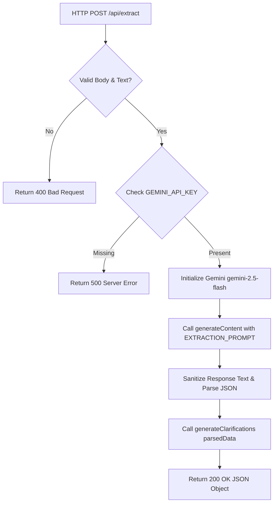

# Technical Specification: Understanding Subsystem

## 1. Purpose
The Understanding Subsystem acts as the linguistic entry point for SomeoneOS. It ingests unorganized user brain dumps and leverages Google Gemini 2.5 Flash to extract structured linguistic entities while enforcing strict JSON schemas.

---

## 2. Responsibilities
- Accepts raw freeform text submitted by the user.
- Prompts Gemini 2.5 Flash using system instructions defined in [prompts/extraction.ts](file:///d:/Codes/Projects/someoneos/prompts/extraction.ts).
- Enforces structured JSON output (`responseMimeType: "application/json"`).
- Sanitizes potential markdown code fences (` ```json `) slipping through LLM responses.
- Invokes the Clarification Engine to verify if extracted entities require user clarification.
- Returns a combined payload (`extraction` + `clarification`) to the client.

---

## 3. Inputs & Outputs
- **Inputs**: HTTP POST JSON payload containing `{ text: string }` submitted to `/api/extract`.
- **Outputs**: HTTP NextApi response object containing:
  ```typescript
  {
    extraction: ExtractionResult;
    clarification: ClarificationResult;
  }
  ```

---

## 4. Dependencies
- `@google/generative-ai` SDK ([lib/gemini.ts](file:///d:/Codes/Projects/someoneos/lib/gemini.ts)).
- Next.js Server Runtime (`NextResponse`).
- System prompt template ([prompts/extraction.ts](file:///d:/Codes/Projects/someoneos/prompts/extraction.ts)).
- Clarification generator ([lib/clarification.ts](file:///d:/Codes/Projects/someoneos/lib/clarification.ts)).

---

## 5. Public Interfaces & Schemas
- **API Endpoint**: `POST /api/extract`
- **Schema Interface** ([types/extraction.ts](file:///d:/Codes/Projects/someoneos/types/extraction.ts)):
  ```typescript
  export interface ExtractionResult {
    events: string[];
    deadlines: string[];
    goals: string[];
    constraints: string[];
    priorities: string[];
    emotionalSignals: string[];
    missingInformation: string[];
  }
  ```

---

## 6. Internal Workflow



---

## 7. Future Extension Points
- **Multi-Modal Ingestion**: Extend the API handler to ingest audio recordings (speech-to-text via Gemini multimodal capabilities) or image upload of handwritten notes.
- **Dynamic Prompt Tuning**: Inject user-specific vocabulary or project glossary context into system instructions.

---

## 8. Known Limitations
- Relying on external network calls to Google Gemini API introduces latency (~1-2 seconds).
- Network errors or API rate limits will cause extraction failures if not caught by retry logic.

---

## 9. Testing Strategy
- **Mock LLM Unit Tests**: Mock `genAI.getGenerativeModel` to verify clean parsing of raw JSON strings and error handling for malformed outputs.
- **Integration Testing**: Execute sample HTTP requests against `/api/extract` verifying valid JSON extraction payloads.
